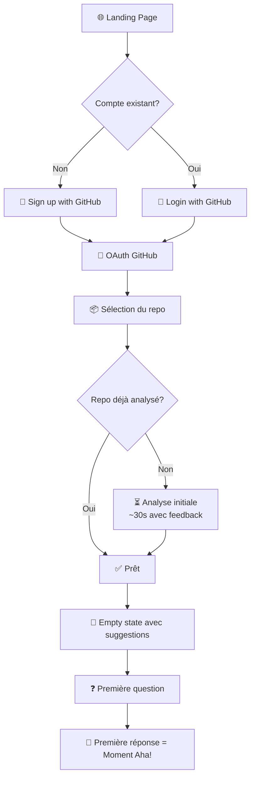

# UX Design Specification - antoineoriol

**Author:** Techno
**Date:** 2026-01-09

---

## Executive Summary

### Project Vision

Un chatbot conversationnel B2B SaaS permettant aux Product Managers et entrepreneurs non-tech de dialoguer en langage naturel avec leur codebase GitHub. La conversation EST la proposition de valeur — pas un dashboard, pas des rapports, mais un dialogue naturel et itératif.

**Positionnement blue ocean :** Aucun concurrent direct sur "non-tech parlant à leur codebase".

### Target Users

**Persona principal : Sarah — PM Junior**
- Contexte : Nouvelle sur un projet legacy, doit préparer le sprint planning
- Besoin : Construire rapidement sa carte mentale du produit
- Moment clé : Répondre avec assurance en réunion sans dire "je demanderai au dev"

**Persona secondaire : Marc — Entrepreneur non-tech**
- Contexte : A fait développer son app par des freelances, prépare une levée de fonds
- Besoin : Due diligence technique pour paraître crédible face aux investisseurs
- Moment clé : Répondre "oui, on a identifié 3 zones de dette technique prioritaires"

**Persona tertiaire : Julie — Head of Product**
- Contexte : Gère une équipe de 4 devs, doit arbitrer la roadmap
- Besoin : Comparer objectivement l'effort entre plusieurs features
- Moment clé : Justifier un arbitrage avec des données techniques

**Profil UX commun :**
- Niveau technique : Faible à moyen (comprennent les concepts, ne lisent pas le code)
- Usage : Asynchrone, ponctuel mais intense (préparation réunions, entretiens, arbitrages)
- État émotionnel : Curieux, pas stressés — besoin d'efficacité ET d'exploration
- Device principal : Desktop (contexte professionnel)

### Key Design Challenges

1. **Usage ponctuel** — L'utilisateur revient après des semaines → interface sans courbe d'apprentissage, onboarding contextuel léger
2. **Contexte préparatoire** — Les réponses doivent être "exportables" pour être utilisées ailleurs (réunion, document)
3. **Réponses adaptatives** — Calibrer automatiquement la longueur selon la complexité de la question
4. **Confiance binaire** — Communiquer clairement quand le système est sûr vs. avoue son ignorance
5. **Feedback d'analyse** — Rendre visible le "travail" du système pendant les analyses longues

### Design Opportunities

1. **Zero learning curve** — L'interface conversationnelle élimine le besoin de formation
2. **Suggestions contextuelles** — Proposer des questions de départ pertinentes dès la connexion du repo
3. **Export first-class** — L'export (PDF/Markdown) est le moment où la valeur se concrétise, pas une feature secondaire
4. **Moment "wow" différenciant** — L'analyse de dette technique peut créer un effet "wow" unique sur le marché
5. **Feedback rassurant** — Transformer l'attente en moment de confiance ("J'analyse 847 fichiers...")

## Core User Experience

### Defining Experience

**Action core :** Poser une question libre en langage naturel et recevoir une réponse qui transforme une codebase opaque en quelque chose de compréhensible.

**Moment "aha" définissant :** L'utilisateur réalise qu'il COMPREND son code — pas juste qu'il a reçu une information, mais qu'il a acquis une compréhension qu'il peut utiliser et partager.

**Nature de l'interaction :** Conversationnelle, fluide, sans friction syntaxique. L'utilisateur parle comme à un collègue technique patient et pédagogue.

### Platform Strategy

| Aspect | Décision | Justification |
|--------|----------|---------------|
| Plateforme principale | Web app desktop-first | Contexte professionnel, préparation de réunions |
| Input | Clavier (chat textuel) | Questions complexes = besoin de précision textuelle |
| Responsive | Mobile fonctionnel | Consultation ponctuelle possible |
| Offline | Non requis | Dépendance API GitHub, usage connecté |

### Effortless Interactions

1. **Connexion GitHub** — OAuth 2 clics, zéro configuration manuelle
2. **Première question** — Suggestions contextuelles non-intrusives pour guider les nouveaux utilisateurs
3. **Compréhension langage naturel** — Le système interprète l'intention même avec formulation approximative
4. **Export** — Un clic pour PDF/Markdown prêt à partager en réunion

### Critical Success Moments

| Moment | Description | Indicateur |
|--------|-------------|------------|
| Premier "aha" | L'utilisateur comprend quelque chose de nouveau sur son code | Expression de surprise/satisfaction |
| Confiance établie | L'utilisateur utilise une réponse en contexte professionnel | Citation en réunion |
| Retour volontaire | L'utilisateur revient sans sollicitation | Usage récurrent pré-réunion |
| Recommandation | L'utilisateur partage l'outil | Bouche-à-oreille organique |

### Experience Principles

1. **"Parle-moi comme à un collègue"** — Aucune syntaxe spéciale, aucun mot-clé requis, langage naturel pur
2. **"La boîte noire s'ouvre"** — Chaque réponse crée un sentiment de compréhension, pas juste d'information
3. **"Pédagogie à la demande"** — Réponses calibrées : concises par défaut, détaillées si complexité ou demande explicite
4. **"Zéro obstacle"** — De la connexion GitHub à la première réponse utile : objectif < 60 secondes

## Desired Emotional Response

### Primary Emotional Goals

| Émotion | Description | Manifestation |
|---------|-------------|---------------|
| **Légitimité** | L'utilisateur se sent compétent sur son propre produit | "Je comprends ce que fait mon code" |
| **Confiance** | Certitude dans les informations reçues | Capable de citer en réunion sans hésiter |
| **Autonomie** | Indépendance vis-à-vis de l'équipe technique | Ne plus attendre qu'un dev soit disponible |

**Émotion centrale :** Passer de "je ne sais pas, je demanderai" à "je sais, je peux répondre".

### Emotional Journey Mapping

| Étape | Émotion visée | Anti-pattern à éviter |
|-------|---------------|----------------------|
| Découverte | Curiosité intriguée | Scepticisme ("encore un outil IA") |
| Première question | Anticipation confiante | Anxiété ("est-ce que ça va marcher?") |
| Réponse reçue | Compréhension + légitimité | Confusion ("je ne comprends pas") |
| Analyse longue | Patience confiante | Frustration ("c'est trop long") |
| "Je ne sais pas" | Confiance renforcée | Déception ("c'est nul") |
| Export/partage | Fierté professionnelle | Gêne ("c'est pas présentable") |
| Retour | Réflexe naturel | Oubli ("j'avais oublié cet outil") |

### Micro-Emotions

**À cultiver :**
- **Confiance > Scepticisme** — Chaque interaction renforce la fiabilité perçue
- **Accomplissement > Frustration** — Chaque réponse apporte une valeur utilisable
- **Clarté > Confusion** — Le vocabulaire est professionnel mais accessible

**À éviter absolument :**
- **Se sentir trompé** — Une info fausse citée en réunion = mort du produit
- **Se sentir idiot** — Le système ne doit jamais faire sentir l'utilisateur incompétent
- **Se sentir perdu** — L'utilisateur doit toujours savoir quoi faire ensuite

### Design Implications

| Émotion cible | Implication UX |
|---------------|----------------|
| Légitimité | Réponses avec sources (fichiers cités) pour permettre la vérification |
| Confiance | Système de confiance binaire — jamais de "peut-être", soit affirmatif soit "je ne sais pas" |
| Autonomie | Pas de dépendance à un onboarding complexe, utilisable immédiatement |
| Patience | Feedback visuel riche pendant les analyses ("J'analyse 847 fichiers dans 12 dossiers...") |
| Fierté | Export soigné, prêt à être partagé tel quel |

### Emotional Design Principles

1. **"La confiance avant tout"** — Mieux vaut un "je ne sais pas" honnête qu'une réponse incertaine
2. **"Tu comprends, donc tu existes"** — Chaque réponse doit créer un sentiment de compréhension, pas juste d'information
3. **"Jamais seul face à l'écran"** — Le système communique son état, ses limites, son travail en cours
4. **"Exportable = valuable"** — Si l'utilisateur ne peut pas réutiliser l'info ailleurs, elle n'a pas de valeur
5. **"Zéro condescendance"** — Vocabulaire professionnel, pas de vulgarisation infantilisante

## UX Pattern Analysis & Inspiration

### Inspiring Products Analysis

#### ChatGPT / Claude — L'interface conversationnelle de référence

| Aspect | Ce qu'ils font bien | Application pour notre produit |
|--------|---------------------|-------------------------------|
| **Simplicité** | Un champ texte, un bouton envoyer — rien de plus | Interface épurée, pas de menus complexes |
| **Fluidité** | Streaming des réponses en temps réel | Réponses progressives pour réduire l'attente perçue |
| **Historique** | Conversations listées, reprises faciles | Historique des questions sur le repo connecté |
| **Feedback** | Indicateur "typing" pendant la génération | Animation pendant l'analyse du code |

#### Perplexity — La recherche avec sources

| Aspect | Ce qu'ils font bien | Application pour notre produit |
|--------|---------------------|-------------------------------|
| **Citations** | Sources cliquables inline dans les réponses | Fichiers/lignes de code cités et cliquables |
| **Confiance** | L'utilisateur peut vérifier l'information | Traçabilité = confiance, aligné avec notre principe émotionnel |
| **Follow-up** | Suggestions de questions liées | Suggestions contextuelles après chaque réponse |

#### Linear — Le B2B SaaS exemplaire

| Aspect | Ce qu'ils font bien | Application pour notre produit |
|--------|---------------------|-------------------------------|
| **Esthétique pro** | Design sombre, typographie soignée, densité d'info maîtrisée | Look & feel professionnel, pas "startup colorée" |
| **Rapidité** | Interface instantanée, pas de loading inutile | Performance perçue comme valeur |
| **Raccourcis** | Keyboard-first pour power users | Shortcuts pour actions fréquentes (export, nouvelle question) |

#### Notion — L'export et le partage

| Aspect | Ce qu'ils font bien | Application pour notre produit |
|--------|---------------------|-------------------------------|
| **Export polyvalent** | PDF, Markdown, HTML en un clic | Export immédiat, formats multiples |
| **Copier-coller riche** | Le contenu copié garde son formatage | Réponses copiables avec mise en forme préservée |
| **Partage** | Liens publics, permissions granulaires | (Post-MVP) Partage de rapports |

### Transferable UX Patterns

#### Navigation Patterns

| Pattern | Source | Application |
|---------|--------|-------------|
| **Single-page app** | ChatGPT, Linear | Pas de rechargement, tout dans une vue |
| **Sidebar conversations** | ChatGPT | Liste des conversations/questions passées |
| **Command palette** | Linear, Notion | Accès rapide aux actions (Cmd+K) |

#### Interaction Patterns

| Pattern | Source | Application |
|---------|--------|-------------|
| **Streaming response** | ChatGPT/Claude | Les mots apparaissent progressivement |
| **Inline citations** | Perplexity | `[fichier.js:42]` cliquable dans la réponse |
| **Suggested follow-ups** | Perplexity | "Questions connexes" après chaque réponse |
| **One-click export** | Notion | Bouton export toujours visible |

#### Visual Patterns

| Pattern | Source | Application |
|---------|--------|-------------|
| **Dark mode default** | Linear | Professionnel, moderne, réduit la fatigue |
| **Monospace pour le code** | Tous | Citations de code clairement identifiables |
| **Typographie claire** | Linear | Hiérarchie visuelle, lisibilité |
| **Whitespace généreux** | Notion | Respiration, pas d'interface surchargée |

### Anti-Patterns to Avoid

| Anti-pattern | Pourquoi l'éviter | Alternative |
|--------------|-------------------|-------------|
| **Onboarding en 10 étapes** | Usage ponctuel = l'utilisateur oublie | Onboarding contextuel minimal |
| **Jargon technique dans l'UI** | Utilisateurs non-tech | Vocabulaire métier PM, pas dev |
| **Spinner sans contexte** | Crée de l'anxiété | Feedback explicite ("J'analyse 847 fichiers...") |
| **Export caché dans un menu** | L'export est LA valeur | Bouton export toujours visible |
| **Réponses sans sources** | Impossible de vérifier | Toujours citer les fichiers sources |
| **Confiance probabiliste** | "75% sûr" crée du doute | Binaire : affirmatif OU "je ne sais pas" |
| **Interface "IA gadget"** | Bulles colorées, avatars cartoon | Design sobre, professionnel |

### Design Inspiration Strategy

#### À adopter directement

| Pattern | Raison |
|---------|--------|
| Interface chat minimaliste (ChatGPT) | Aligné avec "zero learning curve" |
| Citations inline (Perplexity) | Essentiel pour la confiance |
| Streaming des réponses | Réduit l'attente perçue |
| Export one-click (Notion) | "Exportable = valuable" |

#### À adapter

| Pattern | Adaptation nécessaire |
|---------|----------------------|
| Dark mode (Linear) | Proposer light mode aussi (contexte bureau) |
| Command palette | Simplifier — moins de commandes qu'un IDE |
| Suggested follow-ups | Contextualiser aux questions code/produit |

#### À éviter

| Pattern | Conflit avec nos objectifs |
|---------|---------------------------|
| Interface "chat ludique" | Conflit avec crédibilité professionnelle |
| Réponses avec % de confiance | Conflit avec "confiance binaire" |
| Historique permanent complexe | Conflit avec usage ponctuel (export suffit) |

## Design System Foundation

### Design System Choice

**Choix : shadcn/ui + Tailwind CSS**

Un système de design moderne, léger et hautement personnalisable, basé sur Radix UI pour l'accessibilité et Tailwind CSS pour le styling.

**Direction visuelle : Claude × Linear**
- L'approchabilité conversationnelle de Claude
- La précision professionnelle de Linear

### Rationale for Selection

| Facteur | Justification |
|---------|---------------|
| **Esthétique hybride** | Permet de reproduire le mix Claude (warm, conversational) + Linear (sharp, professional) |
| **Flexibilité totale** | Composants copiés dans le projet = contrôle total sur l'esthétique |
| **Dual theme** | Support natif light (Claude-like) et dark (Linear-like) |
| **Performance MVP** | Pas de CSS inutile, bundle optimisé |
| **Accessibilité** | Basé sur Radix UI, WCAG compliant |

### Visual Direction

#### Palette de couleurs

| Contexte | Light Mode (Claude-inspired) | Dark Mode (Linear-inspired) |
|----------|------------------------------|----------------------------|
| Background | Off-white / Crème (#FAFAF9) | Gris profond (#1A1A1A) |
| Surface | Blanc pur | Gris foncé (#2A2A2A) |
| Text primary | Gris très foncé (#1A1A1A) | Blanc cassé (#FAFAF9) |
| Text secondary | Gris moyen (#6B6B6B) | Gris clair (#A0A0A0) |
| Accent | À définir selon branding | À définir selon branding |
| Code background | Gris très léger | Gris plus foncé |

#### Typographie

| Usage | Font | Taille |
|-------|------|--------|
| Body | Inter / System | 15-16px |
| Code | JetBrains Mono / Fira Code | 14px |
| Headings | Inter Medium | 18-24px |

#### Espacements

- Inspiré Claude : généreux, aéré, respiration
- Inspiré Linear : densité maîtrisée où nécessaire (sidebar)

### Implementation Approach

1. **Setup** — Tailwind CSS + shadcn/ui + configuration dual-theme
2. **Tokens** — Variables CSS pour light/dark mode switch
3. **Components core** — Chat interface Claude-like, navigation Linear-like
4. **Animations** — Streaming text + micro-interactions snappy

### Customization Strategy

| Élément | Claude-inspired | Linear-inspired |
|---------|-----------------|-----------------|
| Chat area | Fond chaud, messages fluides | — |
| Sidebar | — | Dense, efficace, raccourcis |
| Boutons | Arrondis, doux | États hover précis |
| Loading | Streaming progressif | — |
| Export | — | Action directe, keyboard shortcut |

### Component Strategy

**Composants shadcn/ui à utiliser :**
- Button, Input, Textarea — interactions de base
- Card — conteneurs de messages
- Dialog — modales (export, settings)
- Dropdown — menus contextuels
- Skeleton — loading states
- Toast — notifications

**Composants custom à créer :**
- ChatMessage — style Claude (pas de bulle système, texte fluide)
- CodeBlock — syntax highlighting, copy button
- AnalysisLoader — streaming + feedback contextuel
- ExportButton — visible, keyboard shortcut (Cmd+E)
- RepoSelector — compact, efficace

## Defining User Experience

### Defining Experience

**L'interaction signature :**
> "Pose une question en langage naturel sur ton code et obtiens une réponse qui t'éclaire."

**Comment l'utilisateur le décrit à un collègue :**
> "C'est comme avoir un dev senior patient qui répond à toutes mes questions sur le code, sans me juger."

**Exemples d'interactions définissantes :**
- "C'est quoi la stack technique ?" → Réponse claire en 5 secondes
- "Si j'ajoute des notifications push, ça impacte quoi ?" → Liste des composants avec sources
- "Où est la dette technique ?" → Analyse complète avec recommandations

### User Mental Model

**Modèle mental actuel (sans le produit) :**
- "Je dois déranger un dev pour poser ma question"
- "Je vais avoir l'air incompétent si je demande"
- "Je ne comprendrai probablement pas la réponse technique"

**Modèle mental cible (avec le produit) :**
- "Je peux poser ma question quand je veux"
- "Le système s'adapte à mon niveau"
- "Je comprends et je peux utiliser la réponse"

**Métaphore familière :**
Le produit = un collègue tech patient et disponible 24/7, qui parle PM, pas dev.

### Success Criteria

| Critère | Indicateur de succès |
|---------|---------------------|
| **Compréhension** | L'utilisateur peut reformuler la réponse dans ses propres mots |
| **Utilisabilité** | L'utilisateur peut utiliser l'info en réunion dans les 24h |
| **Confiance** | L'utilisateur ne ressent pas le besoin de vérifier avec un dev |
| **Fluidité** | < 3 secondes pour questions simples, < 30 secondes pour analyses |
| **Autonomie** | L'utilisateur ne sollicite plus les devs pour des questions basiques |

### Novel UX Patterns

**Pattern établi à adopter :**
- Interface chat conversationnelle (ChatGPT-like) — zéro apprentissage requis

**Innovation spécifique :**

| Pattern | Innovation |
|---------|------------|
| **Citations inline** | `[src/auth.ts:42]` cliquable — le PM peut "prouver" sa source |
| **Confiance binaire** | Pas de % de certitude — soit affirmatif, soit "je ne sais pas" |
| **Feedback contextuel** | "J'analyse 847 fichiers dans 12 dossiers..." — transparence du travail |
| **Pédagogie adaptative** | Réponse concise par défaut, développée si complexité détectée |

### Experience Mechanics

#### 1. Initiation

| Élément | Design |
|---------|--------|
| **Trigger** | Champ de texte central, toujours visible, placeholder invitant |
| **Invitation** | Suggestions de questions si première visite ou conversation vide |
| **État initial** | Repo déjà connecté → prêt à répondre immédiatement |

#### 2. Interaction

| Élément | Design |
|---------|--------|
| **Input** | Textarea auto-resize, Cmd+Enter pour envoyer |
| **Pendant l'envoi** | Message utilisateur apparaît immédiatement |
| **Processing** | Indicateur contextuel ("Analyse en cours...") avec détails si > 2s |

#### 3. Feedback

| Élément | Design |
|---------|--------|
| **Streaming** | Mots apparaissent progressivement (Claude-style) |
| **Citations** | Fichiers sources en inline, cliquables |
| **Code blocks** | Syntax highlighting, bouton copy |
| **Erreur/limite** | Message clair, jamais de mur technique |

#### 4. Completion

| Élément | Design |
|---------|--------|
| **Fin de réponse** | Transition smooth, pas de "Done" explicite |
| **Actions suivantes** | Suggestions de questions connexes (optionnel) |
| **Export** | Bouton visible, Cmd+E |
| **Nouvelle question** | Focus retourne au champ input |

## Visual Design Foundation

### Color System

#### Light Mode (Claude-inspired)

| Token | Valeur | Usage |
|-------|--------|-------|
| `--bg-primary` | #FAFAF9 | Fond principal (off-white chaud) |
| `--bg-secondary` | #FFFFFF | Surfaces, cartes |
| `--bg-tertiary` | #F5F5F4 | Zones de code, inputs |
| `--text-primary` | #1C1C1C | Texte principal |
| `--text-secondary` | #6B6B6B | Texte secondaire, placeholders |
| `--text-muted` | #A3A3A3 | Texte désactivé |
| `--border` | #E5E5E5 | Bordures subtiles |
| `--accent` | #D97706 | Accent chaud (ambre/orange) |
| `--accent-hover` | #B45309 | Accent hover |

#### Dark Mode (Linear-inspired)

| Token | Valeur | Usage |
|-------|--------|-------|
| `--bg-primary` | #0A0A0A | Fond principal (noir profond) |
| `--bg-secondary` | #171717 | Surfaces, cartes |
| `--bg-tertiary` | #262626 | Zones de code, inputs |
| `--text-primary` | #FAFAFA | Texte principal |
| `--text-secondary` | #A3A3A3 | Texte secondaire |
| `--text-muted` | #525252 | Texte désactivé |
| `--border` | #262626 | Bordures subtiles |
| `--accent` | #F59E0B | Accent chaud (ambre) |
| `--accent-hover` | #FBBF24 | Accent hover |

#### Couleurs sémantiques

| Token | Light | Dark | Usage |
|-------|-------|------|-------|
| `--success` | #16A34A | #22C55E | Confirmations, succès |
| `--warning` | #D97706 | #F59E0B | Avertissements |
| `--error` | #DC2626 | #EF4444 | Erreurs |
| `--info` | #2563EB | #3B82F6 | Informations |
| `--code-bg` | #F5F5F4 | #1E1E1E | Fond des blocs de code |

### Typography System

#### Polices

| Usage | Police | Fallback |
|-------|--------|----------|
| **UI / Body** | Inter | system-ui, sans-serif |
| **Code** | JetBrains Mono | Fira Code, monospace |

#### Échelle typographique

| Token | Taille | Line-height | Usage |
|-------|--------|-------------|-------|
| `--text-xs` | 12px | 1.5 | Labels, badges |
| `--text-sm` | 14px | 1.5 | Texte secondaire, métadonnées |
| `--text-base` | 15px | 1.6 | Corps de texte, messages |
| `--text-lg` | 18px | 1.5 | Sous-titres |
| `--text-xl` | 20px | 1.4 | Titres de section |
| `--text-2xl` | 24px | 1.3 | Titres principaux |

#### Poids

| Token | Poids | Usage |
|-------|-------|-------|
| `--font-normal` | 400 | Corps de texte |
| `--font-medium` | 500 | Emphase légère, labels |
| `--font-semibold` | 600 | Titres, boutons |

### Spacing & Layout Foundation

#### Système de spacing (base 4px)

| Token | Valeur | Usage |
|-------|--------|-------|
| `--space-1` | 4px | Micro-espacements |
| `--space-2` | 8px | Espacements compacts |
| `--space-3` | 12px | Padding boutons, inputs |
| `--space-4` | 16px | Espacements standard |
| `--space-6` | 24px | Sections, groupes |
| `--space-8` | 32px | Grandes sections |
| `--space-12` | 48px | Espacement page |
| `--space-16` | 64px | Marges principales |

#### Layout

| Élément | Spécification |
|---------|---------------|
| **Max-width chat** | 768px (centré) |
| **Sidebar width** | 280px (collapsible) |
| **Message padding** | 16px vertical, 0 horizontal |
| **Input area height** | Auto-grow, min 56px |
| **Border radius** | 8px (cards), 6px (buttons), 4px (inputs) |

#### Principes de layout

1. **Respiration** — Espacement généreux dans la zone de chat (Claude-like)
2. **Densité contrôlée** — Sidebar compacte mais lisible (Linear-like)
3. **Focus central** — Conversation au centre, outils en périphérie
4. **Responsive** — Sidebar collapse sur mobile, chat pleine largeur

### Accessibility Considerations

| Critère | Spécification |
|---------|---------------|
| **Contraste texte** | Minimum 4.5:1 (WCAG AA) |
| **Contraste large text** | Minimum 3:1 |
| **Focus visible** | Ring 2px accent color |
| **Touch targets** | Minimum 44×44px |
| **Motion** | Respecter `prefers-reduced-motion` |
| **Font size minimum** | 14px pour le texte interactif |

#### Palette validée WCAG

| Combinaison | Ratio | Statut |
|-------------|-------|--------|
| Text primary / Bg primary (light) | 15.2:1 | ✅ AAA |
| Text secondary / Bg primary (light) | 5.1:1 | ✅ AA |
| Text primary / Bg primary (dark) | 17.4:1 | ✅ AAA |
| Accent / Bg primary (light) | 4.6:1 | ✅ AA |

---

**Note : Direction visuelle mise à jour vers "Fun & Vibrant" — voir section suivante.**

## Design Direction Decision

### Direction choisie : Fun & Vibrant

**Pivot de la direction initiale Claude × Linear vers une approche plus engageante et moderne.**

| Aspect | Décision |
|--------|----------|
| **Mode** | Dark mode par défaut |
| **Couleur dominante** | Rose pétant (#EC4899) |
| **Personnalité** | Fun, moderne, engagée |
| **Arrondis** | Généreux (16-24px, pills) |
| **Espacement** | Très aéré (+40% vs standard) |
| **Émojis** | Utilisés partout pour la personnalité |

### Rationale

1. **Différenciation** — Se démarquer des outils dev "sérieux et gris"
2. **Cible non-tech** — Approche moins intimidante pour les PM
3. **Modernité** — Aligné avec les tendances 2024-2025
4. **Mémorabilité** — Le rose crée une identité visuelle forte

### Palette mise à jour

#### Dark Mode (défaut)

| Token | Valeur | Usage |
|-------|--------|-------|
| `--bg-primary` | #09090B | Fond principal (noir profond) |
| `--bg-secondary` | #18181B | Surfaces, sidebar |
| `--bg-tertiary` | #27272A | Cards, inputs |
| `--accent` | #EC4899 | Couleur principale (rose) |
| `--accent-light` | #F472B6 | Hover, highlights |
| `--accent-glow` | rgba(236,72,153,0.15) | Glow effects |

#### Couleurs secondaires (tags)

| Token | Valeur | Usage |
|-------|--------|-------|
| `--tag-blue` | #3B82F6 | React, TypeScript |
| `--tag-green` | #22C55E | Prisma, success |
| `--tag-purple` | #A855F7 | Fichiers, méta |
| `--tag-orange` | #F97316 | Warnings |

### Layout mis à jour

| Élément | Spécification |
|---------|---------------|
| **Top bar** | Repo selector + tags colorés + export |
| **Sidebar** | Conversations avec émojis, sections datées |
| **Chat area** | Max 800px, padding 48px, margin 40px entre messages |
| **Input** | Border 2px, radius 24px, glow on focus |
| **Arrondis** | sm: 8px, md: 12px, lg: 16px, xl: 24px, full: 9999px |

### Éléments de personnalité

| Élément | Traitement |
|---------|------------|
| **Messages user** | Bulle rose avec shadow glow |
| **Citations code** | Pills rose avec border, hover scale |
| **Loading** | Dots qui bounce (pas juste pulse) |
| **Suggestions** | Pills avec hover glow + translateY |
| **Empty state** | Titre en gradient, icône avec glow |
| **Boutons** | Glow permanent, scale on hover |

### Mockup de référence

Fichier : `_bmad-output/planning-artifacts/ux-design-directions.html`

États disponibles :
- **Chat** — Conversation complète avec réponse
- **Empty** — État initial avec suggestions
- **Loading** — Analyse en cours avec feedback

## User Journey Flows

### Journey 1 : Onboarding (First Time User)

**Objectif :** De la landing page à la première réponse en < 60 secondes.

**Persona :** Sarah (PM junior) découvre le produit.



**Points de friction à éliminer :**
- OAuth = 2 clics max
- Pas de formulaire d'inscription
- Feedback visuel pendant l'analyse initiale

### Journey 2 : Question-Réponse (Core Loop)

**Objectif :** Poser une question et obtenir une réponse utilisable.

**Persona :** Sarah prépare son sprint planning.

```mermaid
flowchart TD
    A[💬 Interface chat] --> B[⌨️ Saisie question]
    B --> C[➤ Envoi question]
    C --> D[📤 Message apparaît]
    D --> E{Analyse requise?}
    E -->|Simple| F[⚡ Réponse < 3s]
    E -->|Complexe| G[🔍 Analyse avec feedback<br/>"J'analyse 847 fichiers..."]
    G --> H[📝 Streaming réponse]
    F --> H
    H --> I[📎 Citations inline<br/>cliquables]
    I --> J[💡 Suggestions follow-up]
    J --> K{Satisfait?}
    K -->|Oui| L[📤 Export ou nouvelle question]
    K -->|Non| M[🔄 Question de suivi]
    M --> B
```

**Optimisations UX :**
- Streaming pour réduire l'attente perçue
- Citations cliquables pour la vérification
- Suggestions pour guider l'exploration

### Journey 3 : Export

**Objectif :** Exporter la conversation pour l'utiliser ailleurs.

**Persona :** Sarah exporte pour sa réunion.

```mermaid
flowchart TD
    A[💬 Conversation en cours] --> B[📤 Clic Export<br/>ou ⌘E]
    B --> C{Format?}
    C -->|PDF| D[📄 Génération PDF]
    C -->|Markdown| E[📝 Génération MD]
    C -->|Copier| F[📋 Copie dans presse-papier]
    D --> G[💾 Téléchargement auto]
    E --> G
    F --> H[✅ Toast "Copié!"]
    G --> I[✅ Toast "Exporté!"]
    H --> J[🎯 Prêt pour la réunion]
    I --> J
```

**Points clés :**
- Export toujours visible (pas caché dans un menu)
- Raccourci clavier (⌘E)
- Feedback immédiat (toast)

### Journey 4 : Analyse dette technique

**Objectif :** Obtenir un rapport complet sur la dette technique.

**Persona :** Marc prépare sa levée de fonds.

```mermaid
flowchart TD
    A[💬 "Analyse la dette technique"] --> B[🔍 Analyse complète<br/>~30-60s]
    B --> C[📊 Feedback détaillé<br/>"Analyse des patterns..."]
    C --> D[📝 Rapport structuré]
    D --> E[🔴 Zones critiques]
    D --> F[🟡 Améliorations suggérées]
    D --> G[🟢 Points positifs]
    E --> H[📎 Fichiers concernés<br/>cliquables]
    F --> H
    G --> H
    H --> I[💡 Suggestions<br/>"Voir le détail de X"]
    I --> J{Action?}
    J -->|Export| K[📤 Export PDF pro]
    J -->|Approfondir| L[❓ Question de suivi]
    L --> A
    K --> M[🎯 Prêt pour les investisseurs]
```

**Moment "wow" :**
- Rapport structuré avec niveaux de criticité
- Prêt à être partagé tel quel
- Crédibilité face aux investisseurs

### Journey Patterns

#### Navigation Patterns

| Pattern | Usage |
|---------|-------|
| **Single-page chat** | Pas de navigation entre pages |
| **Sidebar history** | Accès rapide aux conversations passées |
| **Top bar context** | Repo actuel toujours visible |

#### Feedback Patterns

| Pattern | Usage |
|---------|-------|
| **Streaming response** | Réponses longues |
| **Progress indicator** | Analyses > 2 secondes |
| **Toast notifications** | Actions réussies (export, copie) |
| **Inline citations** | Traçabilité des sources |

#### Error Patterns

| Pattern | Usage |
|---------|-------|
| **Graceful "je ne sais pas"** | Question hors scope |
| **Retry suggestion** | Erreur temporaire |
| **Reformulation hint** | Question mal comprise |

### Flow Optimization Principles

1. **Time to value** — Première réponse utile en < 60 secondes
2. **Progressive disclosure** — Infos complexes révélées progressivement
3. **Feedback constant** — L'utilisateur sait toujours ce qui se passe
4. **Recovery friendly** — Facile de corriger une erreur ou reformuler
5. **Export-ready** — Chaque réponse est exportable immédiatement

## Component Strategy

### Design System Components (shadcn/ui)

Composants natifs à utiliser directement :

| Composant | Usage | Personnalisation |
|-----------|-------|------------------|
| **Button** | Actions primaires/secondaires | Couleurs rose, border-radius 24px |
| **Input / Textarea** | Champ de chat | Border glow rose on focus |
| **Card** | Conteneurs messages | Background secondaire, padding généreux |
| **Dialog** | Modales export, settings | Backdrop blur, animation fade |
| **DropdownMenu** | Menus contextuels | Style dark, accent rose |
| **ScrollArea** | Liste conversations | Scrollbar subtile |
| **Skeleton** | Loading placeholders | Animation pulse rose |
| **Toast** | Notifications | Position bottom-right, accent coloré |
| **Tooltip** | Hints contextuels | Dark, border-radius 8px |
| **Avatar** | Icônes utilisateur/assistant | Émojis ou initiales |

### Custom Components

#### ChatMessage

**Purpose :** Afficher un message utilisateur ou assistant dans le flux de conversation.

**Anatomy :**
- Avatar (emoji ou initiale)
- Timestamp (discret, hover reveal)
- Contenu texte (markdown rendu)
- Citations inline (CodeCitation)
- Actions (copier, exporter)

**States :**
- `default` — Message affiché normalement
- `streaming` — Texte qui apparaît progressivement (assistant)
- `error` — Message d'erreur système
- `hover` — Actions visibles

**Variants :**
- `user` — Bulle rose avec glow, aligné droite
- `assistant` — Fond transparent, aligné gauche

**Accessibility :**
- `role="article"` avec `aria-label` descriptif
- Actions accessibles au clavier

---

#### CodeCitation

**Purpose :** Afficher une référence à un fichier/ligne de code de manière cliquable.

**Anatomy :**
- Icône fichier
- Nom du fichier
- Numéro de ligne (optionnel)
- Badge extension coloré

**States :**
- `default` — Pill avec border subtile
- `hover` — Scale 1.02, glow rose
- `active` — Background accent
- `copied` — Feedback "Copié !"

**Variants :**
- `inline` — Dans le texte (petit)
- `block` — Liste de fichiers (plus grand)

**Accessibility :**
- `role="link"` avec `aria-label` complet
- Focus visible avec ring rose

---

#### CodeBlock

**Purpose :** Afficher un bloc de code avec syntax highlighting.

**Anatomy :**
- Header (langage + bouton copier)
- Code avec highlighting
- Line numbers (optionnel)
- Expand/collapse pour blocs longs

**States :**
- `default` — Collapsed si > 15 lignes
- `expanded` — Hauteur complète
- `copied` — Toast "Code copié !"

**Variants :**
- `inline` — Une ligne, sans header
- `block` — Multi-lignes avec header
- `diff` — Affichage +/- pour comparaisons

**Accessibility :**
- `aria-label` "Code [langage]"
- Bouton copier focusable

---

#### RepoSelector

**Purpose :** Permettre de voir et changer le repo GitHub connecté.

**Anatomy :**
- Icône GitHub
- Nom du repo (owner/name)
- Dropdown chevron
- Badge branch actuelle

**States :**
- `default` — Repo affiché
- `hover` — Background subtil
- `open` — Dropdown avec liste des repos
- `loading` — Skeleton pendant fetch

**Variants :**
- `compact` — Juste le nom
- `full` — Avec description et stats

**Accessibility :**
- `role="combobox"` avec `aria-expanded`
- Navigation clavier dans la liste

---

#### TechTags

**Purpose :** Afficher les technologies/frameworks du projet.

**Anatomy :**
- Icône technologie
- Nom de la techno
- Background coloré par catégorie

**States :**
- `default` — Tag affiché
- `hover` — Scale subtil
- `clickable` — Si filtrage actif

**Colors :**
- React/Frontend → Bleu (#3B82F6)
- Backend/Node → Vert (#22C55E)
- Database → Violet (#A855F7)
- DevOps → Orange (#F97316)

**Accessibility :**
- `role="listitem"` dans une liste
- Contraste texte validé WCAG

---

#### AnalysisLoader

**Purpose :** Afficher le feedback pendant une analyse longue.

**Anatomy :**
- Icône animated (search/scan)
- Message principal ("Analyse en cours...")
- Détails progressifs ("847 fichiers analysés")
- Progress bar ou dots animés

**States :**
- `initial` — "Préparation de l'analyse..."
- `scanning` — "Analyse de X fichiers..."
- `processing` — "Traitement des résultats..."
- `complete` — Transition vers réponse

**Animation :**
- Dots qui bounce (pas juste pulse)
- Chiffres qui s'incrémentent
- Glow pulsé sur l'icône

**Accessibility :**
- `aria-live="polite"` pour les updates
- `role="status"` sur le conteneur

---

#### SuggestionChips

**Purpose :** Proposer des questions de suivi ou de départ.

**Anatomy :**
- Emoji contextuel
- Texte de la suggestion
- Background pill

**States :**
- `default` — Pill avec border
- `hover` — Glow + translateY(-2px)
- `active` — Scale down
- `disabled` — Opacity réduite

**Variants :**
- `question` — Suggestions de questions
- `action` — Suggestions d'actions (export, etc.)

**Accessibility :**
- `role="button"` avec `aria-label`
- Focus ring visible

---

#### EmptyState

**Purpose :** Afficher l'état initial quand aucune conversation n'existe.

**Anatomy :**
- Icône principale avec glow
- Titre en gradient
- Description
- Suggestions de départ (SuggestionChips)

**States :**
- `first-visit` — Avec onboarding hints
- `returning` — Plus direct, moins de texte
- `no-repo` — Call-to-action connecter repo

**Animation :**
- Icône avec glow pulsé
- Fade-in staggered des éléments

**Accessibility :**
- Heading structure correcte
- Suggestions focusables

### Component Implementation Strategy

#### Principes d'implémentation

1. **Design tokens first** — Tous les composants utilisent les CSS variables définies
2. **Composition over inheritance** — Composants petits et composables
3. **Accessibility by default** — ARIA labels et keyboard nav intégrés
4. **Animation opt-out** — Respecter `prefers-reduced-motion`

#### Stack technique

| Layer | Technologie |
|-------|-------------|
| **Base** | React 18+ avec TypeScript |
| **Styling** | Tailwind CSS + CSS variables |
| **Components** | shadcn/ui (base) + custom |
| **Icons** | Lucide React |
| **Animations** | Framer Motion (optionnel) |
| **Code highlighting** | Shiki ou Prism |

#### Structure de fichiers

```
src/components/
├── ui/                    # shadcn/ui components
│   ├── button.tsx
│   ├── input.tsx
│   └── ...
├── chat/                  # Custom chat components
│   ├── ChatMessage.tsx
│   ├── CodeCitation.tsx
│   ├── CodeBlock.tsx
│   ├── AnalysisLoader.tsx
│   └── SuggestionChips.tsx
├── layout/                # Layout components
│   ├── RepoSelector.tsx
│   ├── TechTags.tsx
│   └── EmptyState.tsx
└── index.ts               # Barrel exports
```

### Implementation Roadmap

#### Phase 1 — Core (MVP Launch)

| Composant | Priorité | Justification |
|-----------|----------|---------------|
| ChatMessage | 🔴 Critique | Cœur de l'expérience |
| CodeCitation | 🔴 Critique | Confiance via traçabilité |
| AnalysisLoader | 🔴 Critique | Feedback pendant attente |
| EmptyState | 🟡 Haute | Première impression |

#### Phase 2 — Enhancement

| Composant | Priorité | Justification |
|-----------|----------|---------------|
| CodeBlock | 🟡 Haute | Affichage code détaillé |
| SuggestionChips | 🟡 Haute | Guidage utilisateur |
| RepoSelector | 🟡 Haute | Multi-repo (future) |
| TechTags | 🟢 Moyenne | Contexte visuel |

#### Phase 3 — Polish

| Composant | Priorité | Justification |
|-----------|----------|---------------|
| Animations avancées | 🟢 Moyenne | Delight |
| Themes variants | 🔵 Basse | Light mode |
| Accessibility audit | 🟡 Haute | Compliance |

## UX Consistency Patterns

### Button Hierarchy

| Niveau | Style | Usage | Exemple |
|--------|-------|-------|---------|
| **Primary** | Fond rose (#EC4899), glow, texte blanc | Action principale unique par écran | "Envoyer", "Exporter" |
| **Secondary** | Border rose, fond transparent | Actions alternatives | "Annuler", "Copier" |
| **Ghost** | Pas de border, hover subtil | Actions tertiaires | Icônes, close buttons |
| **Destructive** | Fond rouge (#EF4444) | Actions irréversibles | (Non utilisé MVP) |

**Règles :**
- Maximum 1 bouton Primary visible à la fois
- Toujours un label clair (pas juste une icône sauf si tooltip)
- Minimum 44×44px pour touch targets
- Raccourci clavier affiché si disponible (⌘E)

### Feedback Patterns

| Type | Visuel | Durée | Exemple |
|------|--------|-------|---------|
| **Success** | Toast vert (#22C55E), emoji ✅ | 3s auto-dismiss | "Copié !" |
| **Error** | Toast rouge (#EF4444), emoji ❌ | Manuel dismiss | "Connexion perdue" |
| **Warning** | Toast orange (#F97316), emoji ⚠️ | 5s ou manuel | "Repo très volumineux" |
| **Info** | Toast bleu (#3B82F6), emoji 💡 | 3s auto-dismiss | "Nouveau repo détecté" |
| **Loading** | Inline avec dots bounce | Jusqu'à completion | AnalysisLoader |

**Règles :**
- Position : Bottom-right pour toasts non-bloquants
- Stack max : 3 toasts visibles simultanément
- Erreurs critiques = Dialog modal, pas toast

### Input Patterns

| État | Style | Comportement |
|------|-------|--------------|
| **Default** | Border #27272A, bg #18181B | — |
| **Focus** | Border rose, glow subtil | Placeholder disparaît |
| **Filled** | Même que focus | — |
| **Error** | Border rouge, message sous input | Shake animation légère |
| **Disabled** | Opacity 0.5, cursor not-allowed | — |

**Chat Input spécifique :**
- Auto-resize jusqu'à 200px max
- ⌘+Enter pour envoyer
- Placeholder : "Posez une question sur votre code..."
- Bouton envoyer = icône arrow, state disabled si vide

### Navigation Patterns

| Pattern | Comportement |
|---------|--------------|
| **Sidebar toggle** | Collapse sur clic icône, ⌘+B raccourci |
| **Conversation switch** | Instant, pas de confirmation si conversation en cours |
| **Back to top** | Bouton apparaît après 2 scrolls |
| **Repo switch** | Confirmation si conversation non vide |

**Mobile :**
- Sidebar = drawer plein écran
- Swipe left pour fermer

### Modal & Overlay Patterns

| Type | Usage | Comportement |
|------|-------|--------------|
| **Dialog** | Confirmations, export options | Backdrop blur, ESC ferme |
| **Dropdown** | Menus contextuels | Click outside ferme |
| **Tooltip** | Hints au hover | 500ms delay, persiste si hover |
| **Sheet** | Options complexes (mobile) | Drag to close |

**Règles :**
- Focus trap dans les modals
- Premier élément focusable auto-focused
- Animations : fade 150ms, slide 200ms

### Empty & Loading States

| État | Contenu | Tone |
|------|---------|------|
| **Empty (first visit)** | Titre gradient + 3 suggestions | Accueillant, encourageant |
| **Empty (returning)** | "Nouvelle question ?" + suggestions | Direct, efficace |
| **Loading (court <2s)** | Dots bounce simple | Minimal |
| **Loading (long >2s)** | Feedback contextuel détaillé | Rassurant, informatif |
| **Error state** | Message clair + action retry | Empathique, solution-oriented |

### Interaction Micro-Patterns

| Interaction | Feedback |
|-------------|----------|
| **Hover bouton** | Scale 1.02 + glow intensifié |
| **Click bouton** | Scale 0.98 + transition 100ms |
| **Hover lien** | Underline + couleur accent |
| **Copy action** | Toast + change icône → check 2s |
| **Scroll conversation** | Smooth scroll, snap to messages |
| **Citation click** | Highlight temporaire dans sidebar |

### Keyboard Shortcuts

| Raccourci | Action |
|-----------|--------|
| `⌘ + Enter` | Envoyer message |
| `⌘ + E` | Exporter conversation |
| `⌘ + B` | Toggle sidebar |
| `⌘ + N` | Nouvelle conversation |
| `⌘ + K` | Command palette (post-MVP) |
| `Escape` | Fermer modal/dropdown |

## Responsive Design & Accessibility

### Responsive Strategy

#### Approche : Desktop-First

Le produit cible des utilisateurs en contexte professionnel préparant des réunions — le desktop est le device principal. Le mobile reste fonctionnel mais secondaire.

| Device | Priorité | Usage type |
|--------|----------|------------|
| **Desktop** | 🔴 Principal | Usage quotidien, préparation réunions |
| **Tablet** | 🟡 Secondaire | Consultation ponctuelle |
| **Mobile** | 🟢 Tertiaire | Vérification rapide, urgences |

#### Desktop (1024px+)

| Élément | Comportement |
|---------|--------------|
| **Layout** | Sidebar 280px + Chat centré 800px max |
| **Density** | Espacements généreux, lisibilité optimale |
| **Features** | Toutes les fonctionnalités disponibles |
| **Interactions** | Mouse + keyboard shortcuts |

#### Tablet (768px - 1023px)

| Élément | Comportement |
|---------|--------------|
| **Layout** | Sidebar collapsible (overlay), chat pleine largeur |
| **Density** | Légèrement réduite, touch-friendly |
| **Features** | Identique au desktop |
| **Interactions** | Touch + keyboard si connecté |

#### Mobile (320px - 767px)

| Élément | Comportement |
|---------|--------------|
| **Layout** | Chat uniquement, sidebar = drawer plein écran |
| **Density** | Optimisée touch (44px targets minimum) |
| **Features** | Core features uniquement |
| **Interactions** | Touch, gestures (swipe) |

### Breakpoint Strategy

```css
/* Breakpoints Tailwind customisés */
--breakpoint-sm: 640px;   /* Mobile large */
--breakpoint-md: 768px;   /* Tablet */
--breakpoint-lg: 1024px;  /* Desktop */
--breakpoint-xl: 1280px;  /* Desktop large */
--breakpoint-2xl: 1536px; /* Ultra-wide */
```

#### Règles de breakpoint

| Breakpoint | Changements majeurs |
|------------|---------------------|
| **< 768px** | Sidebar devient drawer, chat pleine largeur |
| **768px - 1023px** | Sidebar overlay on-demand |
| **≥ 1024px** | Layout complet avec sidebar permanente |
| **≥ 1280px** | Espacement augmenté, max-width chat → 900px |

### Accessibility Strategy

#### Niveau de conformité : WCAG 2.1 AA

Objectif AA car :
- Produit B2B professionnel = standards élevés attendus
- Utilisateurs variés (PM, entrepreneurs) = besoins divers
- Legal compliance dans de nombreux contextes entreprise

#### Critères clés

| Domaine | Exigence | Implémentation |
|---------|----------|----------------|
| **Contraste** | 4.5:1 (texte), 3:1 (UI) | Validé avec la palette dark mode |
| **Focus** | Visible sur tous les éléments interactifs | Ring rose 2px |
| **Keyboard** | Navigation complète sans souris | Tab order logique, skip links |
| **Screen readers** | Compatible NVDA, VoiceOver, JAWS | ARIA labels sur tous les composants |
| **Motion** | Respecte prefers-reduced-motion | Animations désactivables |
| **Touch targets** | Minimum 44×44px | Boutons et liens conformes |

#### ARIA Implementation

| Composant | ARIA requis |
|-----------|-------------|
| **Chat messages** | `role="log"`, `aria-live="polite"` |
| **User message** | `role="article"`, `aria-label="Votre message"` |
| **Assistant message** | `role="article"`, `aria-label="Réponse de l'assistant"` |
| **Loading state** | `role="status"`, `aria-busy="true"` |
| **Sidebar** | `role="navigation"`, `aria-label="Conversations"` |
| **Repo selector** | `role="combobox"`, `aria-expanded`, `aria-haspopup` |
| **Export button** | `aria-label="Exporter la conversation"` |
| **Code blocks** | `role="region"`, `aria-label="Code [langage]"` |

#### Skip Links

```html
<!-- En haut de page, visible au focus -->
<a href="#main-chat" class="skip-link">Aller au chat</a>
<a href="#sidebar" class="skip-link">Aller aux conversations</a>
```

### Testing Strategy

#### Tests automatisés

| Outil | Usage | Fréquence |
|-------|-------|-----------|
| **axe-core** | Tests d'accessibilité automatisés | CI/CD |
| **Lighthouse** | Audit performance + a11y | PR reviews |
| **Pa11y** | Tests de régression a11y | Nightly |

#### Tests manuels

| Test | Méthode | Fréquence |
|------|---------|-----------|
| **Keyboard navigation** | Tab through entire app | Chaque feature |
| **Screen reader** | VoiceOver (Mac), NVDA (Windows) | Bi-weekly |
| **Zoom 200%** | Vérifier layout jusqu'à 200% zoom | Chaque feature |
| **Color blindness** | Simulateurs (Deuteranopia, Protanopia) | Design reviews |

#### Devices de test

| Device | Priorité | Raison |
|--------|----------|--------|
| MacBook Pro 14" | 🔴 Haute | Device cible principal |
| Windows laptop 15" | 🔴 Haute | Couverture Windows |
| iPad Pro 12.9" | 🟡 Moyenne | Tablet principal |
| iPhone 14 Pro | 🟡 Moyenne | Mobile iOS |
| Samsung Galaxy S23 | 🟢 Basse | Mobile Android |

### Implementation Guidelines

#### CSS Responsive

```css
/* Mobile-first base, desktop overrides */
.chat-container {
  width: 100%;
  padding: var(--space-4);
}

@media (min-width: 768px) {
  .chat-container {
    padding: var(--space-6);
  }
}

@media (min-width: 1024px) {
  .chat-container {
    max-width: 800px;
    margin: 0 auto;
    padding: var(--space-8);
  }
}
```

#### Reduced Motion

```css
@media (prefers-reduced-motion: reduce) {
  *, *::before, *::after {
    animation-duration: 0.01ms !important;
    animation-iteration-count: 1 !important;
    transition-duration: 0.01ms !important;
  }
}
```

#### Focus Management

```css
/* Focus visible uniquement au clavier */
:focus-visible {
  outline: 2px solid var(--accent);
  outline-offset: 2px;
}

:focus:not(:focus-visible) {
  outline: none;
}
```

#### Semantic HTML Checklist

| Élément | Balise correcte |
|---------|-----------------|
| Messages chat | `<article>` dans `<main role="log">` |
| Sidebar | `<nav>` avec `aria-label` |
| Repo selector | `<select>` ou custom avec ARIA |
| Input chat | `<textarea>` avec `<label>` |
| Code blocks | `<pre><code>` avec lang attribute |
| Boutons | `<button>` (pas `<div>`) |
| Liens | `<a href>` (pas `<span onclick>`) |

### Responsive Component Adaptations

| Composant | Desktop | Tablet | Mobile |
|-----------|---------|--------|--------|
| **ChatMessage** | Padding 24px | Padding 16px | Padding 12px |
| **CodeBlock** | Max-height 400px | Max-height 300px | Max-height 200px |
| **SuggestionChips** | Horizontal scroll | Horizontal scroll | 2 colonnes grid |
| **RepoSelector** | Dropdown | Dropdown | Bottom sheet |
| **Export** | Bouton + dropdown | Bouton + dropdown | Bottom sheet |
| **Sidebar** | Permanente 280px | Overlay toggle | Drawer plein écran |
